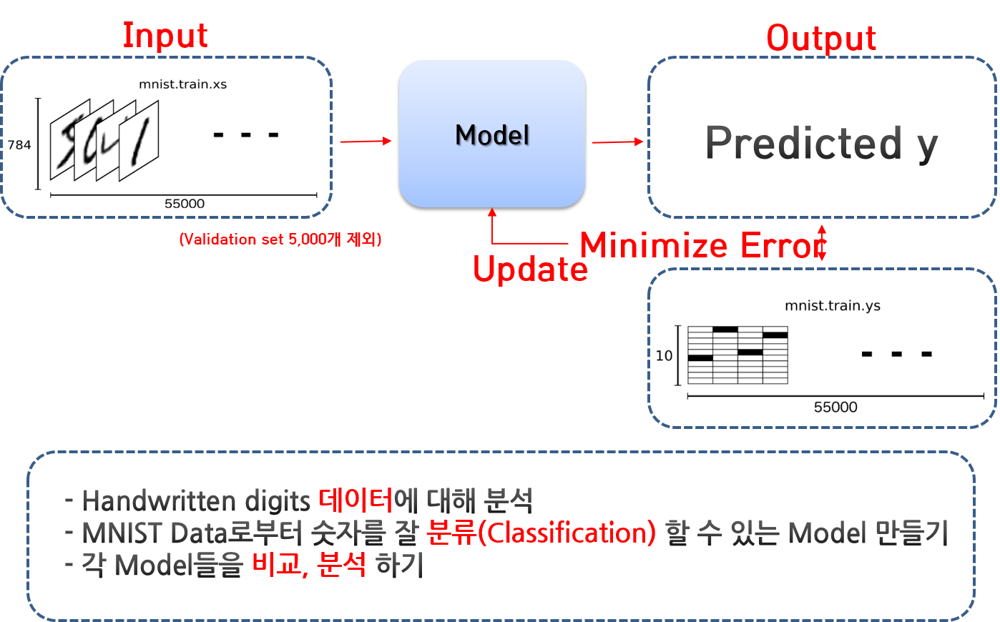
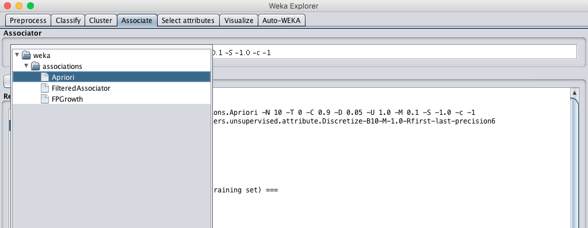

# 2018 인공지능 실습

### 사용 데이터 - MINST

- Mixed National Institute of Standards and Technology database의 약어로, Yann LeCun 교수가 제공
- 이 데이터 각각은 784(28*28 pixel)개의 값으로 각 값은 0~255사이의 값을 가진다.
- 각 데이터는 어떤 숫자를 의미하는지에 대한 값(class)을 가지고 있다. 
- 데이터는 총 70000개로, 60000개의 training set, 10000개의 test set으로 구성되어 있다.

### 모델의 학습과 데이터의 사용

-------------

## Lab1 - 데이터 불러와 처리하기

- MNIST data의 사이즈가 크기 때문에 WEKA에 기본으로 설정된 heap size로 진행하면 어려움이 있을 수 있다.

- Weka의 heap size를 키워서 실행시킬 수 있다.

   `java -Xmx1024m -jar weka.jar` 입력하여 Weka를 불러온다. 

  (1024는 메모리 사이즈로, 시스템에 맞추어 적절히 정한다.)

### Data set 불러오기

1. `Explorer`  선택하기

   

2. `Preprocess > Open file > 파일 유형 arff > 다운받은 데이터 > 열기 `

   

### Data 확인하기

`Preprocess > Edit > Viewer`

### Data Handling

#### Atttibute 삭제하기

1. `Preprocess > Filter > weka > filters > attribute > Remove`

   

> Filter > supervised는 classifier를 선택하여 classifier 기준으로 data를 filtering할 수 있도록 하나, 여기서는 사용자가 원하는 특정 attribute의 번호를 호출하여 삭제하는 것을 원하므로 unsupervised 메뉴에서 선택한다.

2. `Remove > 삭제하려는 attributeIndicate의 번호 입력 > OK > Apply`

   

#### Resampling

1. `Preprocess > Filter > Choose > Weka > filters > unsupervised > instance > Resample`

2. `Resample 클릭 > samplingSizePercent > OK > Apply`

> samplingSIzePercent에 전체 데이터 사이즈 중 사용할 데이터의 퍼센트를 입력한다.

#### Select Attribute

1. `Select attributes > Attribute Evaluator – choose > InfoGainAttributeEval`

   

> InfoGain은 gain값을 기준으로 attribute를 선택하는 매서드이다.

2. `Search Method – choose > Ranker`

> InfoGain은 attribute를 rank하여 원하는 개수를 선택하는 매서드이다. Ranker를 사용한다.

3. `Ranker > numToSelect`

   

> Ranker의 numToSelect는 attribute를 gain값 순서대로 rank를 매겨서 선택할 attribute의 갯수이다.

4. `Start > 값 확인`

   

> gain 순서대로 rank되어 200개의 선택된 attribute들을 확인할 수 있다.

5. `Result list > 결과 마우스 우클릭 > save reduced data > 이름 설정 후 저장`

   

   

   ### MNIST Dataset Visualize

   `visualize 탭`

   

> 모든 attribute의 조합을 보여주며 각 칸은 두개의 attribute를 이용하여 2차원으로 보여주는 형태이다. Class별 색상이 정해져 있다.

## 알고리즘 실습하기

### Lab2 - decision tree (J48 decision tree)

1. `Classify > Choose > weka > classifiers > trees > J48`

> 
>
> Ross Quinla이 ID3를 기반으로 구현 한 C45 알고리즘의 개정판 C48을 weka 에서 java로 구현하여 J48이라는 이름을 붙였다. continuous하거나 discrete한 attribute를 처리할 수 있고, missing value 를 처리하여 모델을 학습시킬 수 있으 며 각 attribute에 다른 cost를 줄 수 있 고 pruning도 가능하다.

2. `J48 > minNumObj`의 숫자를 정한다.  

> minNumObj말고도 다양한 조건을 추가할 수 있다. Tree를 Prun하기위한 값 조정도 가능하다.  

#### cross validation

3. `  Cross-validation > start  `

4. `결과 목록에서 우클릭 > Visualize Tree`  

5. Tree 확인하기  

> tree를 visualize했을 시, 볼 수 없을 만큼 작게 나오는 경우가 있다. 윈도우의 크기를 키운 후, 오른쪽 버튼 클릭하여 fit to Screen을 클릭한다. 
>
> 원형의 노드는 기준을 제시하고 연결선은 참인지 거짓인지 판별한다. 사각형의 노드는 분류된 값이다. 

------------

### Lab3 - bayesian  (Naive bayes)

`choose > bayes -> NaiveBayes`

----------

### Lab4 - Lazy ( IBk : K-NN classifier)

`lazy > IBk`

---------

### Lab5 - Linear Classifier

#### logistic

`functions > Logistic`

### perceptron

1. `function > multilayerPerceptron`

2. `hidden layer` 를 a 에서 1 혹은 0으로 변경

>  Multi-Layer Perceptron의 hidden layer 개수를 조정하여 perceptron을 만든다. 1/0은 single perceptron이고, a 는 hidden layer의 node 개수를 auto로 설정하는 것이다.  여러개의 layer를 원하는 경우 콤마를 이용해 노드의 개수를 정한다.

------------

### Lab6 - association

1. https://gist.github.com/myui/143fa9d05bd6e7db0114 에서 IRIS Dataset 을 다운받는다. 

association 은 numeric value  가 있으면 할 수 없다. 따라서 numeric 을 nominal value 로 바꿔주는 discretization 을 한다. 

2. `preprocess > unsupervised > attribute > discretize`

3. `bin 10 으로 세팅`

> bin 의 갯수만큼 numeric attribute 를 nominal 로 바꿔주게 된다. 
>
> 만약 150cm 부터 200 cm 인 신장(키)데이터가 있다면, 이것을 10 구간으로 나누어서 nominal 로 변환해준다. 

4. `associate > associations > apriori` 

5. `생성된 셋 확인`

-----------------

## Cross validation

> 모델을 학습하는데 사용하는 training set 과 학습된 모델을 검증(validation) 하는데 쓰는 test set 으로 나누어서 실험을 한다. 이때 필연적으로 data loss 가 20~30% 발생하게 되는데,  size 가 작은 data set 에서는 매우 치명적이다. 

#### K-fold Cross Validation

데이터를 나눠서 여러번 검증하는여 평균값을 쓰는 cross validation 방법을 이용하면, data set 을 다 활용하여서 train 함과 동시에 overfit 문제를 해결하기 위해 사용할 수 있다. 

#### Mnist 데이터셋에서 cross-validation 사용/미사용시 분류 정확도 정도

|              사용              |             미사용             |
| :----------------------------: | :----------------------------: |
|  |  |

CV를 사용하지 않은 경우와 사용한 경우의 정확도가 차이남을 확인할 수 있다. Overfitting의 가능성이 높은 모델임을 유추할 수 있다.

-----------

## Lab7 - 모델이미지 Boundary 확인하기

1. `Visualization > BoundaryVisualizer`

2. `Dataset 설정` , `Classifier 설정`, `Visualization Attributes 설정` 후 `Start`

> Plot training data 클릭 시 classification boundary와 함께 데이터 point를 확인할 수 있다.
>
> Add point를 이용해 특정 데이터를 추가하는것이 가능하다.

3. 결과 확인

   

